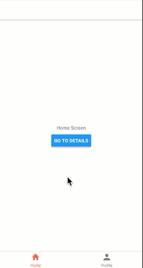

## react-navigation demo
A basic demo of App with two bottom tabs

## Latest screenshots

## steps
* Run `yarn add react-navigation`
* Run `yarn add react-native-gesture-handler`
* Run `react-native link react-native-gesture-handler` to link library. Required step

